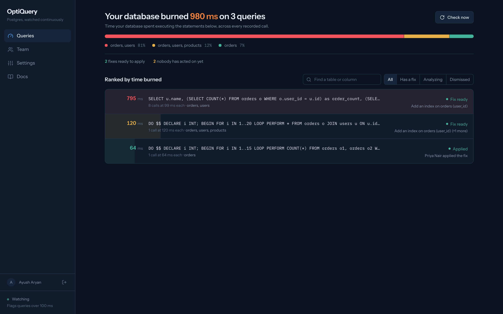
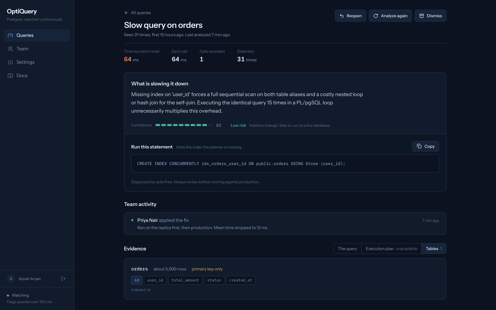
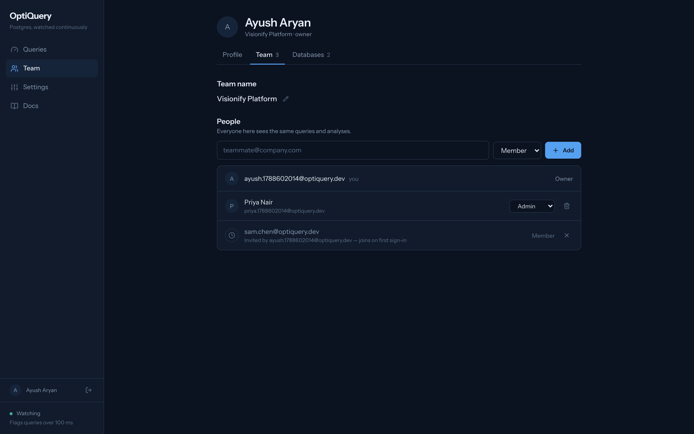
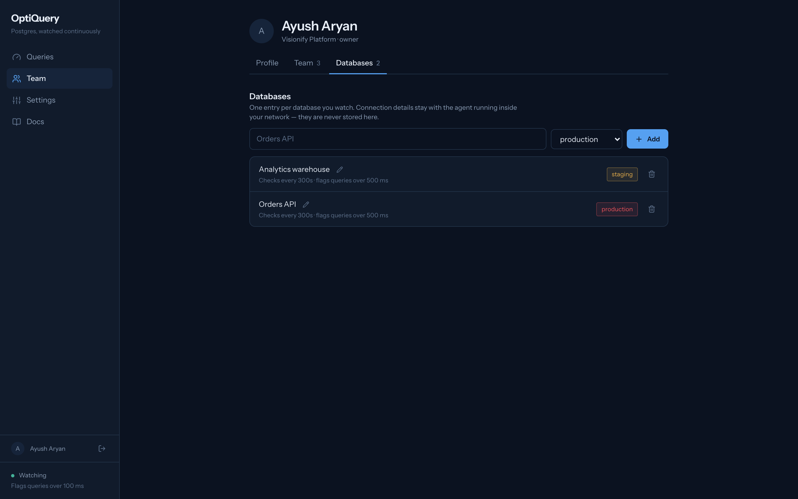
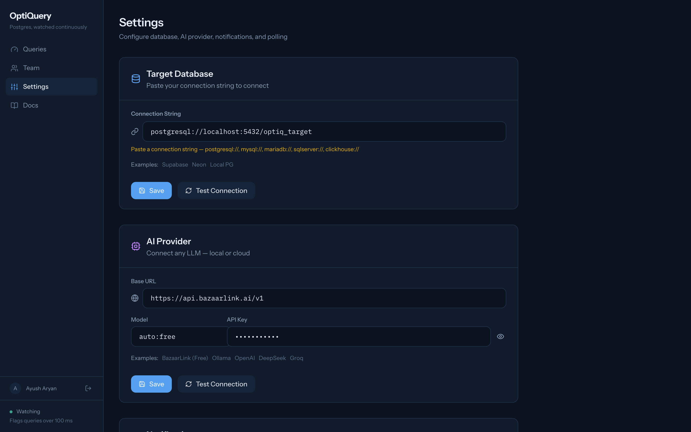
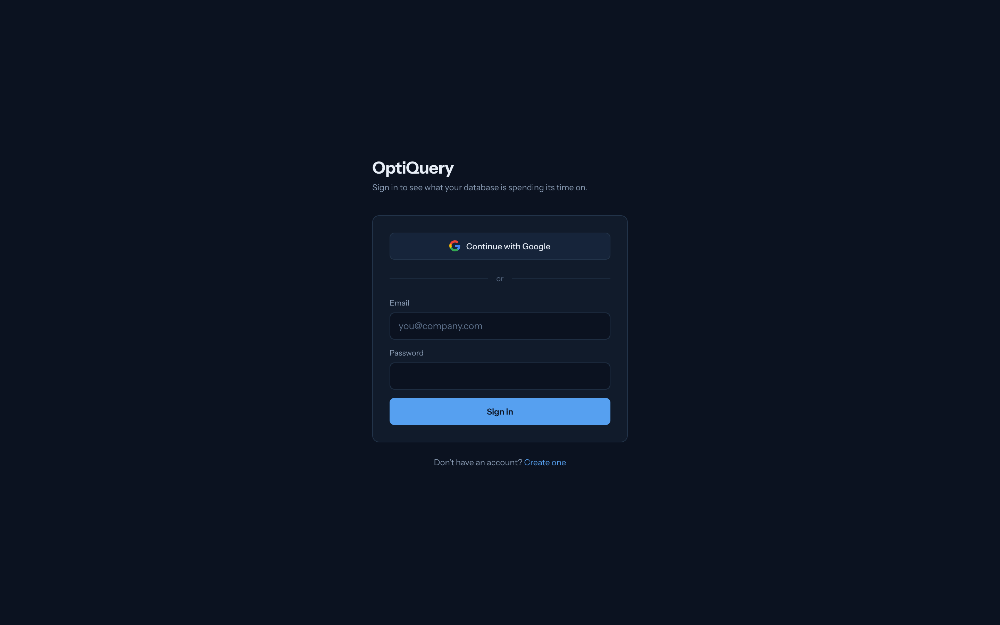

<div align="center">

# OptiQuery

**Find out where your Postgres time actually goes — and what to do about it.**

OptiQuery watches `pg_stat_statements`, pulls execution plans and schema for the
queries that cost you the most, asks an LLM what is wrong, and hands your team a
fix they can check before they run it.

[](https://openjdk.org/)
[](https://spring.io/projects/spring-boot)
[](https://react.dev/)
[](https://www.typescriptlang.org/)
[](https://www.postgresql.org/)
[](https://firebase.google.com/)

</div>

---



<sub>Screenshots show demo data against a local test database.</sub>

## Why it looks like this

Most query dashboards rank by **mean execution time**, which quietly hides the
query that matters. A 20 ms statement called fifty thousand times costs you far
more than a 900 ms statement called twice.

OptiQuery ranks by **time burned** — total execution time across every recorded
call. The bar behind each row *is* that number, so reading the list is reading a
profile. The heaviest thing your database does is always at the top.

---

## What you get

### A verdict you can check, not just trust



The diagnosis comes first, with a confidence score and a plain statement of what
applying it costs you — *"Low risk. Additive change. Safe to run on a live
database."* Then the SQL, ready to copy.

Underneath sits the evidence. **Tables** shows the live schema the model
reasoned about — `orders`, about 5,000 rows, *primary key only*, with unindexed
columns marked. When the diagnosis says a column needs an index, you can see for
yourself that it has none.

When Postgres cannot produce a plan — a `DO` block, or a statement with bind
parameters — OptiQuery says so in words and explains what it used instead,
rather than showing you a stack trace.

### A team that can see who did what



OptiQuery does not run SQL against your database. A person does, and then records
it, so the next engineer to open that query sees **"Priya Nair applied the fix"**
instead of running the same index a second time. The dashboard counts how many
ready fixes *nobody has acted on yet*.

Add people by email whether or not they already have an account — an invite is
held until they first sign in, and stays visible until it is accepted or
withdrawn.

### One entry per database you watch



Connection details stay with the agent inside your network. They are never
stored here.

---

## Quick start

```bash
git clone https://github.com/yourname/optiquery.git
cd optiquery

# 1. PostgreSQL 16 with pg_stat_statements enabled
brew services start postgresql@16

# 2. Backend  → http://localhost:8080
cd backend && mvn spring-boot:run

# 3. Frontend → http://localhost:3000
cd frontend && npm install && npm run dev
```

Open <http://localhost:3000> and set your database and AI provider in
**Settings**. Nothing else needs configuring — no `.env` required.

> **`mvn compile` is not enough if you run the packaged jar.** `start.sh` runs
> `java -jar target/*.jar`, so use `mvn package -DskipTests` after changing
> backend code, or you will serve a stale build.

### The monitored database needs `pg_stat_statements`

```sql
-- postgresql.conf
shared_preload_libraries = 'pg_stat_statements'   -- then restart

-- in the database you want watched
CREATE EXTENSION IF NOT EXISTS pg_stat_statements;
```

OptiQuery only needs **read access**. It never writes to the database it watches.

---

## Configuration

Settings live in exactly two places, and the split matters:

| What | Where | Notes |
|---|---|---|
| Database, AI provider, polling | **Settings**, in the app | Authoritative at runtime. Changes apply on the next check — no restart. |
| Non-secret defaults and paths | `backend/src/main/resources/application.yml` | Committed to git and packaged into the jar. |
| Secrets | Environment variables | `application.yml` ships to anyone who gets the build — never put a key there. |

Application properties are **first-run seeds only**. Once a value exists in
Settings, editing the file changes nothing.



### Bring your own AI

Any OpenAI-compatible endpoint works — OpenAI, Ollama, Groq, DeepSeek, or a
local model. Your key stays in your installation.

---

## Sign-in



Authentication is **optional**. With no Firebase configuration the app runs
exactly as it did before accounts existed — no login wall, no Firestore — which
keeps a local checkout usable without a cloud project.

To enable it, create a Firebase project with **Firestore in Native mode**, then:

```bash
# frontend/.env — public by design; these identify the project, they do not grant access
VITE_FIREBASE_API_KEY=...
VITE_FIREBASE_AUTH_DOMAIN=your-project.firebaseapp.com
VITE_FIREBASE_PROJECT_ID=your-project
VITE_FIREBASE_APP_ID=...

# backend — a service account key. Keep it out of git.
export OPTIQ_FIREBASE_CREDENTIALS=/path/to/serviceAccountKey.json
export OPTIQ_FIREBASE_PROJECT_ID=your-project
```

Enable Google and/or Email-Password under **Authentication → Sign-in method**.

> The service account key grants full project access and bypasses every security
> rule. It is gitignored; if one ever lands in a commit, rotate it in the
> console rather than deleting the file.

---

## How it works

```
┌──────────────────┐        reads, never writes        ┌────────────────────┐
│   OptiQuery      │ ────────────────────────────────▶ │  Your PostgreSQL   │
│   daemon         │   pg_stat_statements, EXPLAIN,    │  (the database     │
│                  │   information_schema              │   being watched)   │
│  ┌────────────┐  │                                   └────────────────────┘
│  │ Poller     │  │   interval + threshold from Settings, re-read each cycle
│  ├────────────┤  │
│  │ Context    │  │   schema snapshot + execution plan
│  ├────────────┤  │
│  │ AI engine  │  │ ─────────▶  your LLM provider, your key
│  └────────────┘  │
└────────┬─────────┘
         │
         ├──────────▶  Firestore   teams, members, projects, activity, entitlements
         ├──────────▶  Slack / Discord / Teams / any webhook
         └──────────▶  REST API  ──▶  React dashboard
```

The polling loop reads its interval from Settings **after every cycle**, so
changing it takes effect on the next check rather than at the next restart.

### Roadmap

The next step is splitting the daemon into a **customer-side agent**: it runs
inside your network, holds the database credentials and AI key locally, and
pushes findings out to Firestore. Nothing inbound to open, and no third party
holding your production database password.

**More detail:** [Architecture](docs/ARCHITECTURE.md) ·
[Configuration](docs/CONFIGURATION.md) ·
[Troubleshooting](docs/TROUBLESHOOTING.md) ·
[Contributing](docs/DEVELOPMENT.md)

---

## API

| Method | Path | Purpose |
|---|---|---|
| `GET` | `/api/queries/slow?sort=totalTime` | Ranked slow queries. `sort=meanTime` also available |
| `GET` | `/api/queries/slow/{id}` | One query with its analysis |
| `POST` | `/api/queries/{id}/apply` | Record that someone ran the fix |
| `POST` | `/api/queries/{id}/reopen` | Undo an apply or a dismissal |
| `POST` | `/api/queries/{id}/dismiss` | Stop ranking this query |
| `POST` | `/api/queries/{id}/reanalyze` | Run the diagnosis again |
| `GET` | `/api/queries/{id}/activity` | Who did what to this query |
| `GET` | `/api/queries/stats` | Counts and total time burned |
| `GET` | `/api/orgs` | Your teams. Creates one on first use |
| `GET/POST/DELETE` | `/api/orgs/{id}/members` | Team membership |
| `GET/DELETE` | `/api/orgs/{id}/invites` | Pending invitations |
| `GET/POST/PATCH/DELETE` | `/api/orgs/{id}/projects` | Monitored databases |
| `GET` | `/api/health` | Status, thresholds, plan |

---

## Project layout

```
backend/src/main/java/com/optiq/
├── config/       Firebase, target database, polling schedule, AI provider
├── controller/   REST endpoints
├── model/        Entities and value types
├── scheduler/    The polling loop
├── security/     Firebase token verification
└── service/      Monitoring, analysis, settings, teams, activity, entitlements

frontend/src/
├── lib/          Domain logic — formatting, triage, schema parsing, API clients
└── pages/        Dashboard, QueryDetail, Account, Settings, Docs
```

Presentation logic lives in `frontend/src/lib/query.ts`, not in components.

---

<div align="center">
<sub>Built with Spring Boot, React and LangChain4j.</sub>
</div>
